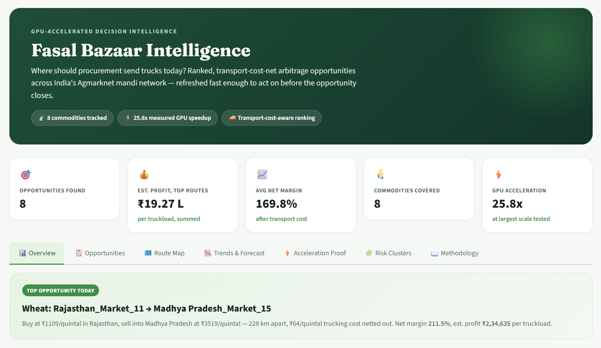
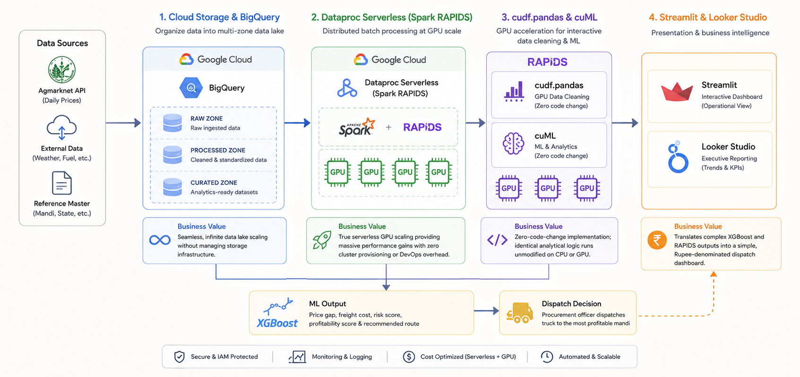

# 🌾 Fasal Bazaar Intelligence

**GPU-accelerated agricultural commodity arbitrage detection for India's Agmarknet mandi network.**

Tells a procurement officer exactly which mandi to send a truck to today — after netting out real trucking cost against the price gap, not a naive price-difference flag — and proves the GPU acceleration claim with a multi-scale CPU vs GPU benchmark, at both an interactive and a distributed-batch layer, rather than one cherry-picked number.

Built for the **Gen AI Academy APAC Edition** hackathon (Google Cloud + NVIDIA track).

[](https://www.python.org/)
[](https://streamlit.io/)
[](https://cloud.google.com/)
[](https://rapids.ai/)

---



## Table of contents

- [The problem](#the-problem)
- [What makes this different](#what-makes-this-different)
- [Architecture](#architecture)
- [Repository structure](#repository-structure)
- [Quick start](#quick-start)
- [Methodology notes](#methodology-notes)
- [Business Value & Scalability](#business-value--Scalability)
- [Future Scope & Roadmap](#future-scope--roadmap)
- [Rubric mapping](#rubric-mapping)
- [Acknowledgments](#acknowledgments)

---

## The problem

Agmarknet publishes daily prices across thousands of mandis and hundreds of commodities. Comparing them by hand — or with a CPU-bound script — is slow enough that by the time a price gap is spotted, it's often already closed. Worse, a naive "biggest gap wins" approach routinely recommends routes where trucking cost would exceed the profit.

---

## What makes this different

- 🚚 **Transport-cost-aware, not a price-gap flag.** Every opportunity has real haversine-distance freight cost subtracted before it counts.
- 📅 **Persistence-filtered.** A gap has to hold for multiple days to rank highly — one-day noise gets filtered out.
- ⚡ **Two independent acceleration proofs, not one number.** cudf.pandas at the interactive layer, Spark RAPIDS on Dataproc Serverless at the distributed-batch layer — same code, benchmarked at multiple scales.
- 💰 **Rupee-denominated output.** Every recommendation ships with an estimated profit per truckload, not just a percentage.
- ✅ **Tested decision logic.** A pytest suite validates the ranking math itself — including a test that confirms a price gap is correctly *rejected* when trucking cost would exceed it.

---

## Architecture



Two independent acceleration proofs: the notebook benchmarks **cudf.pandas** against plain pandas at multiple data scales (interactive layer), and the Dataproc job benchmarks the identical Spark ETL logic with and without the **RAPIDS Accelerator** (distributed-batch layer).

---

## Repository structure

```
fasal-bazaar-intelligence/
├── README.md                          <- you are here
├── .gitignore
├── pipeline_core.py                   <- shared clean/analyze/rank logic, unit-tested
├── notebooks/
│   └── fasal_bazaar_intelligence_v2_full_scale.ipynb
├── tests/
│   ├── test_pipeline.py               <- 15 tests: pytest tests/ -v
│   ├── pipeline_core.py               <- local copy so the notebook stays Colab-portable
│   └── requirements.txt
├── streamlit_app/                     <- the decision-layer dashboard
│   ├── app.py
│   ├── requirements.txt
│   ├── Dockerfile                     <- Cloud Run-ready
│   ├── .dockerignore
│   ├── .streamlit/config.toml         <- forces light theme (see Methodology notes)
│   ├── README.md
│   └── data/                          <- drop notebook outputs here (gitignored)
├── dataproc_job/                      <- distributed Spark RAPIDS batch layer
│   ├── spark_arbitrage_job.py
│   ├── submit_cpu_job.sh
│   ├── submit_gpu_job.sh
│   └── README_dataproc.md
├── gcp_setup/
│   └── setup_gcp.sh                   <- one-shot GCS + BigQuery provisioning
└── docs/
    ├── images/
    ├── Fasal_Bazaar_Intelligence_Submission_Deck.pptx
    └── demo_video_script.md
```
---

## Quick start

1. **Notebook**: upload `notebooks/fasal_bazaar_intelligence_v2_full_scale.ipynb` to
   [Google Colab](https://colab.research.google.com) (GPU runtime). Runs immediately on
   realistic synthetic data; swap in real Agmarknet data via `RAW_CSV_PATH` when ready.
2. **Tests**: `pip install -r tests/requirements.txt && pytest tests/ -v`
3. **Dashboard**:
   ```bash
   cd streamlit_app
   pip install -r requirements.txt
   streamlit run app.py
   ```
   Opens at `localhost:8501`, running on demo data out of the box.
4. **GCP setup** (optional, for the distributed layer): edit and run `gcp_setup/setup_gcp.sh`,
   then see `dataproc_job/README_dataproc.md`.
5. **Deploy the dashboard** (optional): `streamlit_app/` has a validated `Dockerfile` —
   `gcloud run deploy fasal-bazaar-intelligence --source . --allow-unauthenticated --memory 1Gi`
   from inside that folder. No local Docker install needed.
   
---

## Methodology notes

- **Transport cost assumption**: `₹0.28/km/quintal`, based on typical Indian medium-truck
  freight rates (~₹25-30/km for a ~10-tonne load). Configurable in `pipeline_core.py`
  (`RS_PER_KM_PER_QUINTAL_DEFAULT`). Distance is haversine (great-circle), not real road
  distance — a ranking signal, not a routing engine.
- **Rolling window**: "7-day" rolling mean/std/z-score is actually "last 7 rows" (row-based,
  not calendar-based) — kept deliberately consistent between the pandas and Spark
  implementations so the numbers don't silently diverge.
- **State median**: exact in the pandas pipeline, approximate (`percentile_approx`) in the
  distributed Spark job — a standard, necessary tradeoff at scale.
- **The GPU Constrain** NVIDIA's public RAPIDS benchmarks (150x, 400x+) are on
  specific operations and often datacenter-class GPUs. A Colab T4 or a modest Dataproc L4
  allocation has realistically showed single-to-low-double-digit speedups on most operations.

---

## Business Value & Scalability

- **Commercial Impact:** Protects enterprise margins by mathematically preventing truck dispatches to unprofitable, high-freight mandis. Converts hours of manual Agmarknet data extraction into seconds of automated query.  

- **Cloud Scalability:** Architected entirely on managed Google Cloud services. Dataproc Serverless and BigQuery allow the system to seamlessly scale to cover all 2,700+ Indian mandis without requiring any virtual machine DevOps.

---

## Future Scope & Roadmap

As a solo build developed within a strict hackathon timeframe, several enterprise-grade features were intentionally scoped out for future implementation. The architecture is designed to seamlessly integrate these upcoming enhancements:

- **GKE-Deployed Serving:** Transitioning from the current deployment model to Google Kubernetes Engine (GKE) for robust, scalable model serving and orchestration.
- **GPUDirect Storage Tuning:** Optimizing I/O data pathways to maximize GPU throughput and reduce latency during intensive procurement computations.
- **Cloud Storage Rapid Buckets:** Implementing high-performance storage configurations for faster, more efficient data access at scale.
- **Looker Studio Integration:** Building a comprehensive, interactive Looker Studio dashboard to provide end-users with accessible business intelligence and visual analytics.
- **Conversational AI Layer:** Integrating the Gemini Enterprise Agent Platform to allow users to interact with the data and arbitage models using natural language.

---

## Rubric mapping

| Requirement | Where it's answered |
|---|---|
| Real user | Procurement officer / FMCG commodity buyer |
| Decision bottleneck | Naive price-gap tools ignore transport cost; stale comparisons miss the window to act |
| Data pipeline | Architecture diagram above; `notebooks/`, `dataproc_job/` |
| Useful output | `streamlit_app/` — ranked opportunities, route map, profit estimate per truckload |
| Acceleration proof | Notebook's multi-scale benchmark + `dataproc_job/`'s distributed CPU/GPU comparison |

---

## Acknowledgments

Built for the Gen AI Academy APAC Edition hackathon, Google Cloud + NVIDIA track. Agmarknet
price data structure from the Government of India's Agricultural Marketing portal.
